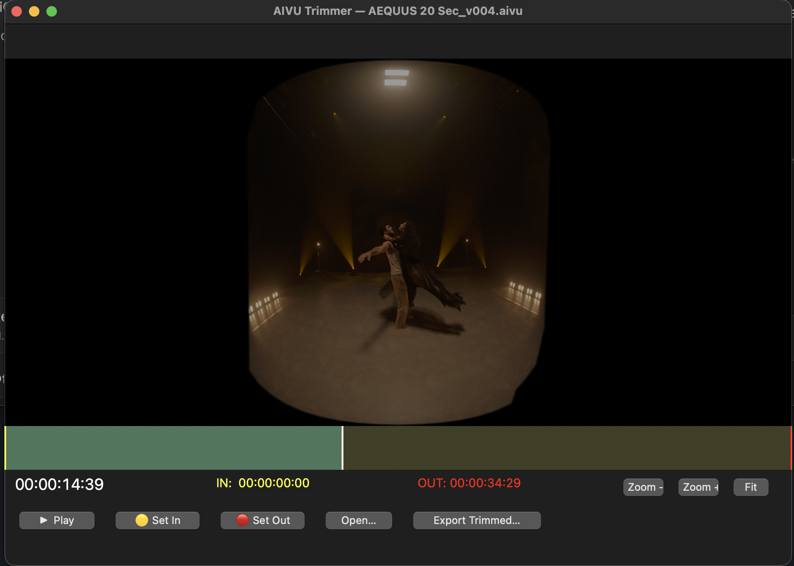

# AIVU Trimmer

A lightweight macOS tool for **trimming Apple Immersive Video (`.aivu`) files** —
with two export modes:

1. **Lossless `.aivu`** — a trimmed copy with no re-encoding, preserving the
   Apple-specific immersive metadata (AIME / VenueDescriptor / spatial audio).
2. **Side-by-side MP4 for Meta Quest 3** — a stereoscopic SBS H.265 clip at 60 fps,
   ready to drop onto a Quest 3 and play in a VR video player.

Set in/out points on a visual player with a timecode display, then export.



## Features

- **Native playback** of `.aivu` files via AVFoundation / AVKit
- **Timecode display** (HH:MM:SS:FF at 45 fps)
- **Visual in/out points** — drag the **yellow** bar for the in point and the
  **red** bar for the out point on the timeline
- **Sample-accurate scrubbing** (zero-tolerance seeking, no keyframe snapping)
- **Scroll-wheel nudging** of the playhead (±1 second per tick)
- **Zoom in/out** of the preview to inspect detail
- **Lossless `.aivu` export** using `AVAssetExportSession` with passthrough — writes
  a real `.aivu` that opens in Apple Immersive Video Utility
- **VR180 side-by-side MP4 export** (Meta Quest 3): decodes both MV-HEVC eye views,
  **reprojects each from Apple's lens projection into equirectangular**, packs them
  side-by-side at 7680×3840, drops 90→60 fps **without changing speed**, and encodes
  HEVC with Apple's hardware encoder (`hevc_videotoolbox`)
- **Rectilinear 16:9 export** — a true **gnomonic** flat mono 16:9 video (H.264) of
  the immersive footage (perspective reprojection via the **ST map**). For normal
  screens / editing.
- **Color LUT** option — preview a `.cube` 3D LUT live on the player and bake it
  into the MP4 exports (e.g. Blackmagic Gen 5 Film → Rec709). See [`luts/`](luts/)
- **Contrast / Gamma / Gain** grade controls that update the **preview live** and
  apply to every export
- **Live progress bar** with percentage during all exports

## Requirements

- **macOS 26 (Tahoe) or newer** — required for AVFoundation's
  `com.apple.immersive-video` export support. The app will run on older macOS but
  exporting `.aivu` will fail.
- **Python 3.10+**
- The PyObjC frameworks listed in [`requirements.txt`](requirements.txt)
- **FFmpeg** (for the SBS + rectilinear MP4 exports) with the `hevc_videotoolbox` /
  `h264_videotoolbox` encoders — the standard macOS builds include them:
  ```bash
  conda install -c conda-forge ffmpeg     # or: brew install ffmpeg
  ```
  The lossless `.aivu` export does **not** need FFmpeg.
- **numpy + Pillow** (only the first time you run a rectilinear export, to derive
  the remap maps from the ST map EXR): `pip install numpy pillow`
- An **immersive ST map EXR** for the rectilinear export (Blackmagic provides these
  for the URSA Cine Immersive). The app prompts for it the first time.

## Installation

```bash
git clone https://github.com/balldeela/aivu-trimmer.git
cd aivu-trimmer
python3 -m pip install -r requirements.txt
```

## Usage

```bash
python3 aivu_trimmer.py                 # opens a file picker
python3 aivu_trimmer.py movie.aivu      # or open a file directly
```

1. Pick an `.aivu` file when prompted (or use **Open…**).
2. Scrub the timeline / use the scroll wheel to find your in point, press **Set In**
   (or drag the yellow bar).
3. Find your out point, press **Set Out** (or drag the red bar).
4. Optionally set a **LUT** and the **Contrast / Gamma / Gain** sliders (the preview
   updates live).
5. Export:
   - **Export .aivu…** — lossless trimmed Apple Immersive Video (or a graded
     re-encode if a look is active),
   - **Export SBS MP4 (Quest)…** — side-by-side stereo clip for Meta Quest 3, or
   - **Export Rectilinear 16:9…** — flat mono 16:9 video for normal screens.

### Controls

| Action | How |
|---|---|
| Play / pause | **Play** button |
| Set in point | **Set In** button, or drag the yellow bar |
| Set out point | **Set Out** button, or drag the red bar |
| Seek | Click / drag on the timeline |
| Nudge playhead ±1s | Scroll wheel over the timeline |
| Zoom preview | **Zoom +** / **Zoom −** / **Fit** buttons |
| Grade (live) | **Contrast / Gamma / Gain** sliders, **Reset** |
| Export lossless `.aivu` | **Export .aivu…** button |
| Export side-by-side MP4 | **Export SBS MP4 (Quest)…** button |
| Export flat 16:9 video | **Export Rectilinear 16:9…** button |
| Apply a color LUT | **Color LUT** dropdown |

## How the lossless `.aivu` trim works

Export uses `AVAssetExportSession` with the **passthrough** preset and an output
file type of `com.apple.immersive-video`. This copies the compressed MV-HEVC
bitstream directly (no re-encode) and lets AVFoundation preserve the proprietary
AIVU boxes, so the result opens correctly in Apple Immersive Video Utility.

> **Note on cut accuracy:** like any lossless trim on any format, the start of the
> output snaps to the nearest keyframe in the source. Your exact in point may shift
> by up to one GOP interval. Avoiding this would require re-encoding.

## How the side-by-side MP4 export works (VR180 equirectangular)

Apple Immersive Video stores each eye in a **parametric lens projection**, not
equirectangular. Quest's "180° / side-by-side" player modes assume **equirectangular
VR180** — so simply stacking the two eyes renders with the wrong geometry
(over-wide FOV, curved horizons, off convergence). The export therefore **reprojects
each eye into equirectangular** using an ST map before packing:

```
ffmpeg -ss <in> -t <dur> -i input.aivu -i sbs_equirect_x.png -i sbs_equirect_y.png \
  -filter_complex "[0:v:view:0][0:v:view:1]hstack=inputs=2,scale=8640:4320[s];\
                   [s][1][2]remap=format=color:fill=black,fps=60[v]" \
  -map "[v]" -map "0:a:0?" \
  -c:v hevc_videotoolbox -b:v 60M -tag:v hvc1 -c:a aac -b:a 192k \
  -movflags +faststart output_VR180_SBS_60fps.mp4
```

- Both MV-HEVC eye views are decoded (`view:0` / `view:1`) and hstacked.
- FFmpeg's `remap` reprojects **Apple lens projection → equirectangular** per eye,
  driven by 16-bit pixel maps derived from the **ST map** EXR (same map as the
  rectilinear export). Output is **7680×3840** (per eye 3840 = 180°×180°).
- The `fps=60` filter resamples 90→60 fps **by timestamp** (drops frames, no speed
  change).
- Encoded as HEVC (H.265) — H.264 can't exceed 4096 px.

> The SBS export now needs the **ST map EXR** (it prompts the first time, same as the
> rectilinear export) and **numpy + Pillow** to derive the maps.

On the Quest 3, copy the `.mp4` over and open it in a VR video player
(DeoVR, Skybox, etc.), then select a **side-by-side / 180° stereo** viewing mode to
match the source projection.

## Color LUTs

The **Color LUT** dropdown previews a `.cube` 3D LUT **live on the player** (via a
Core Image `CIColorCube` video composition) and bakes it into the side-by-side MP4
export (via FFmpeg's `lut3d` filter). It's intended for converting **Blackmagic
Cine immersive footage (Gen 5 Film color science) to Rec709**.

> The on-screen preview is a fast Core Image approximation (and flattens to a single
> eye while filtering); the exported file uses FFmpeg's exact `lut3d` result.

- The app discovers `.cube` files from the [`luts/`](luts/) folder, and if that's
  empty, falls back to the Gen 5 Rec709 LUTs that ship with **DaVinci Resolve**.
- The Blackmagic `.cube` files are **not redistributed** in this repo — they're
  Blackmagic's. Install DaVinci Resolve (free) or drop your own LUTs in `luts/`.
- LUTs apply to the MP4 exports and the preview.

> **Only apply a Film→Rec709 LUT to log/Film-gamma footage.** If your `.aivu` is
> already display-ready (graded Rec709), the LUT will double-correct it. Leave the
> dropdown on **No LUT** when in doubt.

## Contrast / Gamma / Gain

Three sliders apply a simple grade (gain → contrast → gamma) that updates the
**preview live** and is baked into every export:

- **Preview & graded `.aivu`** use Core Image (`CIColorMatrix` / `CIColorControls`
  / `CIGammaAdjust`).
- **SBS & rectilinear MP4** use the equivalent FFmpeg `lutrgb` expression.
- **Reset** returns all three to neutral (1.00).

When a grade or LUT is active and you hit **Export .aivu…**, the app asks how to
proceed:

- **Lossless & ungraded** — copies the original bitstream untouched (the LUT/grade
  are ignored), giving a true lossless immersive `.aivu`.
- **Re-encode & graded** — bakes the look in, which flattens it to a **mono, standard
  (non-immersive) movie**.

The grade/LUT still always affect the SBS and rectilinear MP4 exports and the
preview.

## Rectilinear (flat 16:9) export

**Export Rectilinear 16:9…** produces a true **gnomonic** flat **mono 16:9** video
(1920×1080, H.264, 90° horizontal FOV) for normal screens or an editing timeline —
straight lines stay straight.

- The pixel maps compose a **perspective (gnomonic) projection** with the ST map's
  equirectangular UV: each output pixel casts a camera ray → spherical angle →
  equirectangular position → the ST map's source UV. So it reprojects all the way
  from Apple's lens projection to a flat rectilinear view (not a crop of equirect).
- The first time, the app asks for the ST map `.exr` (Blackmagic provides these for
  the URSA Cine Immersive) and caches the derived 16-bit maps in `cache/`
  (regenerated automatically; not committed).
- The FOV is set by `RECTI_HFOV_DEG` (default 90°). Any active grade / LUT is baked in.

## License

[MIT](LICENSE)
